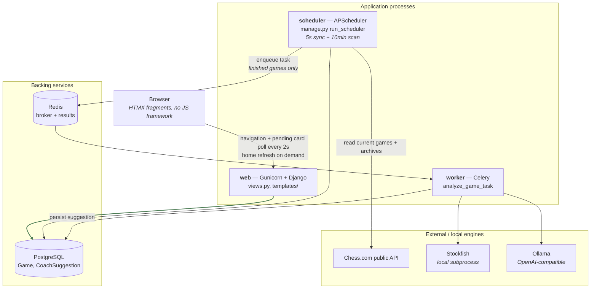
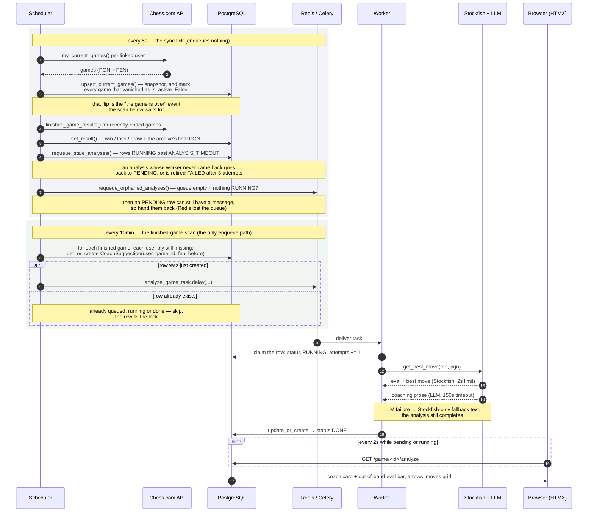

# Architecture

The app is not a single Django process. It is **four processes plus two backing
services**, and understanding why is the fastest way into the codebase.

The reason is latency: a coach analysis costs ~2s of Stockfish plus 20–30s of
CPU LLM inference. That can't happen inside a request, so it happens in a Celery
worker. Something has to notice that a game has ended and enqueue the work —
that's APScheduler. The web process, as a result, never talks to Chess.com and
never runs the engine: it only reads the database.

**The app reviews games, it does not watch them.** A game is analysed once it is
over, one suggestion per move you actually played, and a game still in progress
is snapshotted but never shown. Two consequences follow, and most of the design
below is downstream of them: there is no live poll anywhere, and the position you
are *about* to play is never analysed.

## Components

Note what is **missing** from that graph: there is no arrow from `web` to
Chess.com, to Stockfish or to the LLM. Every view renders from the stored
snapshot alone, which is what makes navigating a game as cheap as opening it.

## The analysis flow

Two things to hold on to.

**Analysis begins when a game ends.** Nothing is queued while you are still
playing — not the moves already in the PGN, and not the position you are about to
play. What marks a game as finished is that it stopped appearing in Chess.com's
current-games list, which `sync_current_games` records as `is_active=False`. So
the 5s tick never enqueues: its job is to capture games (Chess.com serves the PGN
only while a game is current, so a game missed there is gone) and to revive stuck
analyses.

**The one enqueue step is a reconciliation pass, not a trigger.** It does not
fire "when something happens". It compares what the PGN says you played against
the `CoachSuggestion` rows that exist and queues the difference, which is why
running it every ten minutes forever is both safe and the whole point — a game
whose closing moves only arrived with the archive's PGN, or whose task was lost,
is picked up on a later run instead of being lost.

### Surviving a worker restart

The task is acknowledged after it runs, not when it is delivered
(`CELERY_TASK_ACKS_LATE` with `CELERY_TASK_REJECT_ON_WORKER_LOST`, in
[`settings.py`](../chessdotcom_ai_coach/settings.py)), so an analysis in flight
when the worker goes down is not simply lost. How fast it comes back depends on
*how* the worker died, and the difference is worth knowing:

- **Graceful stop** (`docker compose restart`/`stop`, a redeploy) — Celery hands
  its un-acked messages back to the broker on the way out. The analysis is
  re-delivered within seconds and starts over from the beginning.
- **Hard kill** (OOM, `docker kill`, a stop that outruns its grace period while
  an analysis is mid-LLM-call) — nothing gets to hand anything back. The messages
  sit in Redis' `unacked` set, and kombu only re-delivers them after its
  visibility timeout, an hour by default.

So the broker is *not* the guarantee in the case that matters most. That is
`requeue_stale_analyses`, which returns any row left RUNNING for
`ANALYSIS_TIMEOUT` to the queue — 10 minutes, whatever the broker is doing.
Treat re-delivery as an optimisation on top of it, not the mechanism.

Either way a task can be run more than once, so `attempts` bounds it: the worker
counts the attempt as it claims the row, and the fourth claim retires the
position as FAILED instead of running it again.

## Component reference

| Component | Entry point | Notes |
| --- | --- | --- |
| Scheduler jobs | [`management/commands/run_scheduler.py`](../chessdotcom_ai_coach/management/commands/run_scheduler.py) | Two: `POLL_INTERVAL_SECONDS = 5` and `FINISHED_SCAN_MINUTES = 10`. Both `max_instances=1` and `coalesce=True`, so a slow run never overlaps the next. |
| Tick body | [`services/scheduler.py`](../chessdotcom_ai_coach/services/scheduler.py) | `sync_current_games`, `backfill_results`, `requeue_stale_analyses`, `requeue_orphaned_analyses` — each called in its own `try/except` so a Chess.com outage still leaves the local recovery checks running. Enqueues nothing. |
| Stuck-analysis recovery | [`services/scheduler.py`](../chessdotcom_ai_coach/services/scheduler.py) | Two halves: `requeue_stale_analyses` for a row whose *worker* died (RUNNING past `ANALYSIS_TIMEOUT`), `requeue_orphaned_analyses` for one whose *message* did (PENDING while the broker queue is empty and nothing is RUNNING). |
| Finished-game scan | [`services/scheduler.py`](../chessdotcom_ai_coach/services/scheduler.py) | `enqueue_finished_game_analyses` — the only path that enqueues work. Unbounded in time (a game is checked for as long as it is stored, so one whose result never resolved is still covered) and bounded in volume by `ENQUEUE_BUDGET_PER_RUN`. Its cadence is the delay you feel: analysis of a game starts up to ten minutes after its last move. |
| Celery task | [`tasks.py`](../chessdotcom_ai_coach/tasks.py) | `analyze_game_task` claims the row (RUNNING, `attempts += 1`), then wraps the async coach in `async_to_sync`. Kept thin deliberately, so `services/coach.py` stays untouched and its test mocking seam still applies. |
| Coach | [`services/coach.py`](../chessdotcom_ai_coach/services/coach.py) | `get_best_move(fen, pgn)` → a `Suggestion` TypedDict. Stockfish first (2s), then the LLM (150s timeout); on LLM error it returns Stockfish-only prose rather than failing. |
| Chess.com IO | [`services/chess_client.py`](../chessdotcom_ai_coach/services/chess_client.py) | `my_current_games()` and `finished_game_results()`. Pure IO + shape normalisation, no DB access. |
| Persistence | [`services/game_store.py`](../chessdotcom_ai_coach/services/game_store.py) | Pure DB reads/writes: `upsert_current_games`, `past_games`, `set_result`, `stored_game`. No Chess.com access. |
| Board rendering | [`services/board.py`](../chessdotcom_ai_coach/services/board.py) | Expands FEN/PGN into what templates can iterate over. |
| Views | [`views.py`](../chessdotcom_ai_coach/views.py) | Thin, except `_position_context` (see below). |
| Whole-game reconcile | [`services/analysis.py`](../chessdotcom_ai_coach/services/analysis.py) | `enqueue_game_analysis` — the idempotent enqueue, applied to every move the user played in a game. Shared by the finished-game scan and by `manage.py analyze_game`. `_covered_plies` reads the game's existing rows in one query and matches on `(move_no, side to move)`, so the FEN spellings never diverge into duplicates. |

## Board rendering

Django's template language can't parse a FEN, so [`services/board.py`](../chessdotcom_ai_coach/services/board.py)
does it in Python:

- **`fen_to_cells(fen, highlight, flipped)`** — expands a FEN into a flat list of
  64 cell dicts (`glyph`, `light`, `highlight`, `white`) in reading order, or
  reversed when the board is flipped for a black player.
- **`moves_from_pgn(pgn)`** — one entry per ply: `{move_no, color, san, uci, fen_before}`.
  `fen_before` is the position the player was about to play — **the same position
  the coach analyses**, which is what ties a suggestion back to its move.
- **`positions_from_pgn(pgn)`** — the FEN after each ply, initial position first,
  index-aligned with `moves_from_pgn` (`positions[i + 1]` is the position reached
  by `moves[i]`). The review page renders any selected move straight from this
  list, so nothing has to re-implement castling, promotion or en passant.
- **`annotate_moves(moves, suggestions)`** — joins suggestions onto moves by
  **`(move_no, color)`, not by FEN**. Chess.com and python-chess format the
  en-passant and halfmove-clock fields differently, so a string comparison on FEN
  would silently miss; `(move_no, color)` is a unique key for a ply within a game
  and survives that difference.

Every one of these degrades gracefully: a malformed FEN yields an empty board, an
unparseable PGN yields `[]`.

## `_position_context`

[`views.py::_position_context`](../chessdotcom_ai_coach/views.py) is the biggest
function in the project and produces everything the position fragment needs for
one ply: board cells, eval-bar fill, SVG arrow coordinates, the moves grid, the
analysis-history timeline and the coach card's mode.

The concept worth knowing is the **ply cursor `sel`**:

- `sel = 0` — the starting position.
- `head` — the number of plies in the PGN, i.e. the last move actually played,
  and the end of the timeline. `sel` is clamped to it.

There is deliberately **no cursor past `head`**. A position the player never
reached has no move to comment on, so the timeline simply stops — which is also
why a `CoachSuggestion` row left over for such a position is invisible without
any filtering: `annotate_moves` joins rows onto the plies in the PGN, and there
is no ply to join to.

The coach card is then rendered in one of five modes — `start`, `opponent`,
`unanalyzed`, `pending`, `failed`, `analyzed` — and the eval bar carries the last
analysed value forward across un-analysed plies so it never snaps back to 50%.

## The HTMX layer

There is no custom JavaScript. Everything is a fragment swap:

- **Home** (`home.html`) does not poll. Its **Refresh** button fetches `/games`
  on demand — a plain DB read — and swaps the game grid in place; the fragment
  also carries an `hx-swap-oob` copy of the game count that lives outside the
  swapped container.
- **Detail** (`partials/position.html`) does not poll either. A finished game
  does not change, so navigation is the only thing that swaps `#gr-view`.
- **Pending coach cards** (`partials/coach_card.html`) self-poll
  `/game/<id>/analyze` `every 2s` until the worker finishes. PENDING and RUNNING
  both render as that pending card — the distinction matters to the scheduler,
  not to someone waiting for an answer.
- **Keyboard navigation** is done with HTMX triggers, not JS:
  `hx-trigger="click, keydown[key=='ArrowLeft'] from:body"`.
- The coach card uses `hx-swap-oob` to update the eval bar, board arrows, moves
  grid and history **out of band**, so a freshly-arrived analysis refreshes the
  board without re-swapping the whole view.

## Layering rules

These are conventions, not enforced by tooling, but the whole codebase follows
them and new code should too:

1. **`services/chess_client.py` does Chess.com IO only** — no DB, no Django models.
2. **`services/game_store.py` does DB only** — no HTTP calls.
3. **`services/scheduler.py` orchestrates the two** and is where per-user
   exception handling lives (a bad account is logged and skipped, never allowed
   to break the batch).
4. **Views stay thin and never call Chess.com.** They read the snapshot.
5. **Idempotency via `get_or_create` on a unique key** is the standard way to
   enqueue work — see `analysis.enqueue_game_analysis`. It is what lets the
   enqueue path be a reconciliation that can run on a schedule, rather than a
   one-shot trigger whose failure loses the work.
6. **Only finished games are analysed or shown.** `views._reviewable_game` is the
   single gate for the second half of that, and `game_store.past_games` for the
   first; nothing else should reach for `is_active` on its own.

## One layout quirk

The Django *project* package and the *app* are the same module. `settings.py`,
`urls.py`, `wsgi.py` and `celery.py` sit alongside `models.py`, `views.py` and
`migrations/` inside [`chessdotcom_ai_coach/`](../chessdotcom_ai_coach/). If you
expected the usual `project/` + `app/` split, this is why you can't find it. The
only other app is [`theme/`](../theme/), which is static assets only (CSS, fonts,
images) and has no Python beyond the app config.
