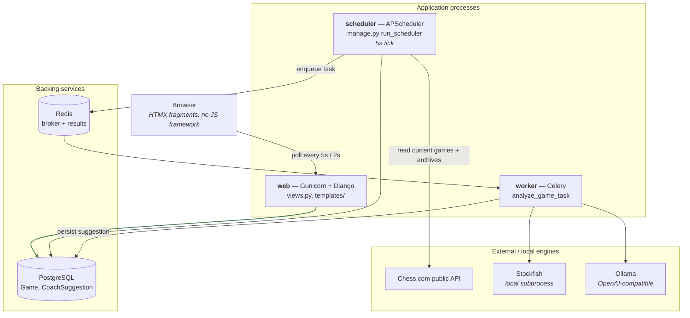
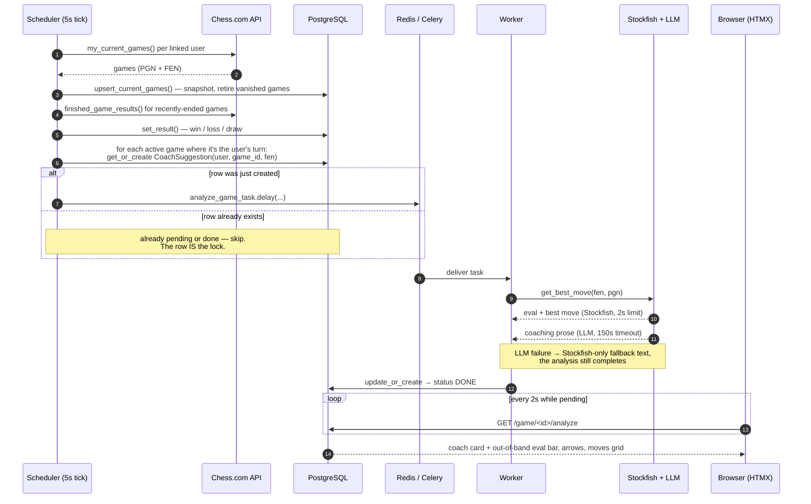

# Architecture

The app is not a single Django process. It is **four processes plus two backing
services**, and understanding why is the fastest way into the codebase.

The reason is latency: a coach analysis costs ~2s of Stockfish plus 20–30s of
CPU LLM inference. That can't happen inside a request, so it happens in a Celery
worker. Something has to notice that it's your turn and enqueue the work — that's
APScheduler. The web process, as a result, never talks to Chess.com and never
runs the engine: it only reads the database.

## Components

Note what is **missing** from that graph: there is no arrow from `web` to
Chess.com, to Stockfish or to the LLM. Every view renders from the stored
snapshot alone, which is what makes navigation, the live poll and reviewing a
finished game all equally cheap.

## The analysis flow

## Component reference

| Component | Entry point | Notes |
| --- | --- | --- |
| Scheduler tick | [`management/commands/run_scheduler.py`](../chessdotcom_ai_coach/management/commands/run_scheduler.py) | `POLL_INTERVAL_SECONDS = 5`, matching the home page's own HTMX cadence. `max_instances=1` and `coalesce=True` so a slow tick never overlaps the next. |
| Tick body | [`services/scheduler.py`](../chessdotcom_ai_coach/services/scheduler.py) | `sync_current_games`, `backfill_results`, `enqueue_due_analyses` — each called in its own `try/except` so a Chess.com outage still leaves the local enqueue check running. |
| Celery task | [`tasks.py`](../chessdotcom_ai_coach/tasks.py) | `analyze_game_task` wraps the async coach in `async_to_sync`. Kept thin deliberately, so `services/coach.py` stays untouched and its test mocking seam still applies. |
| Coach | [`services/coach.py`](../chessdotcom_ai_coach/services/coach.py) | `get_best_move(fen, pgn)` → a `Suggestion` TypedDict. Stockfish first (2s), then the LLM (150s timeout); on LLM error it returns Stockfish-only prose rather than failing. |
| Chess.com IO | [`services/chess_client.py`](../chessdotcom_ai_coach/services/chess_client.py) | `my_current_games()` and `finished_game_results()`. Pure IO + shape normalisation, no DB access. |
| Persistence | [`services/game_store.py`](../chessdotcom_ai_coach/services/game_store.py) | Pure DB reads/writes: `upsert_current_games`, `current_games`, `past_games`, `set_result`, `stored_game`. No Chess.com access. |
| Board rendering | [`services/board.py`](../chessdotcom_ai_coach/services/board.py) | Expands FEN/PGN into what templates can iterate over. |
| Views | [`views.py`](../chessdotcom_ai_coach/views.py) | Thin, except `_position_context` (see below). |
| Whole-game backfill | [`services/analysis.py`](../chessdotcom_ai_coach/services/analysis.py) | `enqueue_game_analysis` — same idempotent enqueue, applied to every move of a game. |

## Board rendering

Django's template language can't parse a FEN, so [`services/board.py`](../chessdotcom_ai_coach/services/board.py)
does it in Python:

- **`fen_to_cells(fen, highlight, flipped)`** — expands a FEN into a flat list of
  64 cell dicts (`glyph`, `light`, `highlight`, `white`) in reading order, or
  reversed when the board is flipped for a black player.
- **`moves_from_pgn(pgn)`** — one entry per ply: `{move_no, color, san, uci, fen_before}`.
  `fen_before` is the position the player was about to play — **the same position
  the coach analyses**, which is what ties a suggestion back to its move.
- **`positions_from_pgn(pgn)`** — the FEN after each ply, initial position first,
  index-aligned with `moves_from_pgn` (`positions[i + 1]` is the position reached
  by `moves[i]`). The review page renders any selected move straight from this
  list, so nothing has to re-implement castling, promotion or en passant.
- **`annotate_moves(moves, suggestions)`** — joins suggestions onto moves by
  **`(move_no, color)`, not by FEN**. Chess.com and python-chess format the
  en-passant and halfmove-clock fields differently, so a string comparison on FEN
  would silently miss; `(move_no, color)` is a unique key for a ply within a game
  and survives that difference.

Every one of these degrades gracefully: a malformed FEN yields an empty board, an
unparseable PGN yields `[]`.

## `_position_context`

[`views.py::_position_context`](../chessdotcom_ai_coach/views.py) is the biggest
function in the project and produces everything the position fragment needs for
one ply: board cells, eval-bar fill, SVG arrow coordinates, the moves grid, the
analysis-history timeline and the coach card's mode.

The concept worth knowing is the **ply cursor `sel`**:

- `sel = 0` — the starting position.
- `head` — the number of plies in the PGN, i.e. the last move actually played.
- `live_sel` — the end of the timeline. When a game is live *and* it's your turn,
  this is `head + 1`: a **live slot** for the move you're about to play. It gets
  its own cursor so the opponent's last move stays reviewable at `head`.

The coach card is then rendered in one of several modes — `start`, `opponent`,
`unanalyzed`, `pending`, `analyzed`, `live_waiting`, `live_request`,
`live_pending`, `live_analyzed` — and the eval bar carries the last analysed
value forward across un-analysed plies so it never snaps back to 50%.

## The HTMX layer

There is no custom JavaScript. Everything is a fragment swap:

- **Home** (`home.html`) polls `/games` `every 5s` — a plain DB read.
- **Detail** (`partials/position.html`) polls `/game/<id>/live` `every 5s`,
  sending its current `sel` and the `head` it already knows; the view returns
  **204 No Content** when nothing changed, so an idle game costs almost nothing.
- **Pending coach cards** (`partials/coach_card.html`) self-poll
  `/game/<id>/analyze` `every 2s` until the worker finishes.
- **Keyboard navigation** is done with HTMX triggers, not JS:
  `hx-trigger="click, keydown[key=='ArrowLeft'] from:body"`.
- The coach card uses `hx-swap-oob` to update the eval bar, board arrows, moves
  grid and history **out of band**, so a freshly-arrived analysis refreshes the
  board without re-swapping the whole view.

## Layering rules

These are conventions, not enforced by tooling, but the whole codebase follows
them and new code should too:

1. **`services/chess_client.py` does Chess.com IO only** — no DB, no Django models.
2. **`services/game_store.py` does DB only** — no HTTP calls.
3. **`services/scheduler.py` orchestrates the two** and is where per-user
   exception handling lives (a bad account is logged and skipped, never allowed
   to break the batch).
4. **Views stay thin and never call Chess.com.** They read the snapshot.
5. **Idempotency via `get_or_create` on a unique key** is the standard way to
   enqueue work — see both `scheduler.enqueue_due_analyses` and
   `analysis.enqueue_game_analysis`.

## One layout quirk

The Django *project* package and the *app* are the same module. `settings.py`,
`urls.py`, `wsgi.py` and `celery.py` sit alongside `models.py`, `views.py` and
`migrations/` inside [`chessdotcom_ai_coach/`](../chessdotcom_ai_coach/). If you
expected the usual `project/` + `app/` split, this is why you can't find it. The
only other app is [`theme/`](../theme/), which is static assets only (CSS, fonts,
images) and has no Python beyond the app config.
