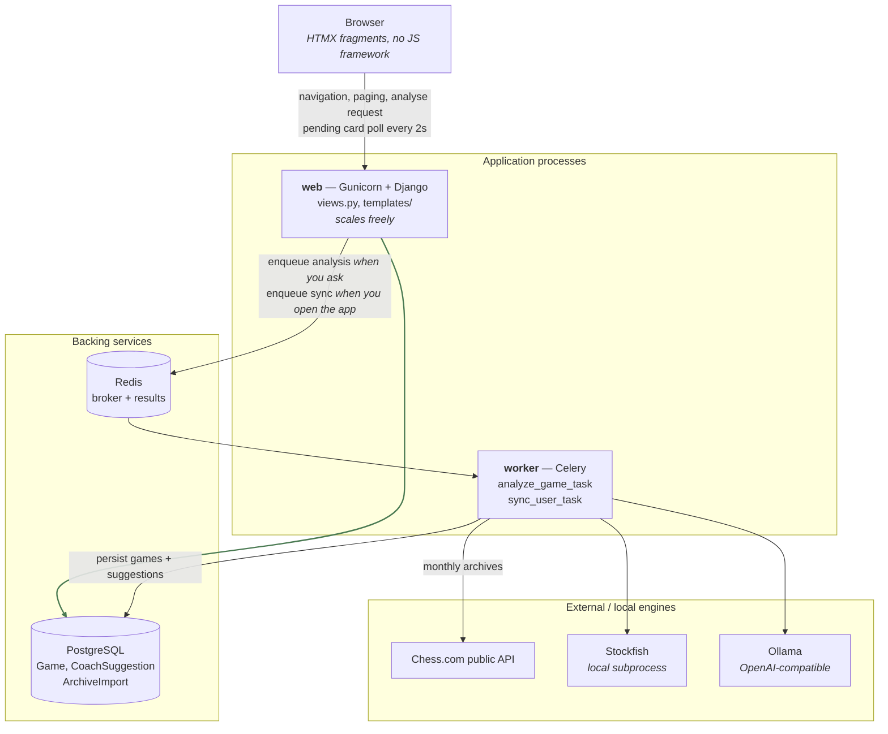
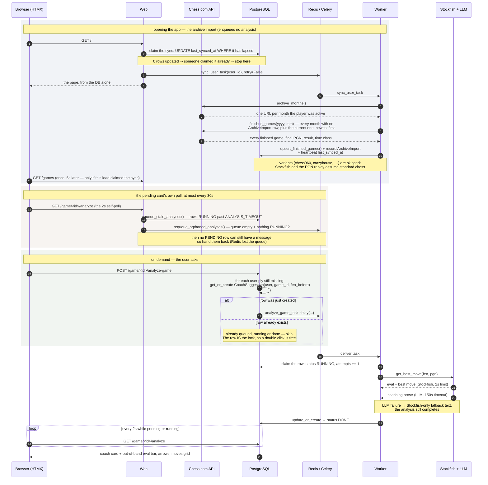

# Architecture

The app is not a single Django process. It is **two processes plus two backing
services**, and understanding why is the fastest way into the codebase.

The reason is latency: a coach analysis costs ~2s of Stockfish plus 20–30s of
CPU LLM inference. That can't happen inside a request, so it happens in a Celery
worker. Keeping the local mirror of your games up to date is slow for a different
reason — one HTTP call per archive month — so it goes to the same worker. The web
process, as a result, never talks to Chess.com and never runs the engine: it only
reads the database.

**Nothing is scheduled.** There is no cron, no Celery Beat, no scheduler process:
both background jobs are enqueued from the request path, by the user they are
for. That is what lets `web` scale to as many replicas as it likes — a scheduler
living inside it would run once per replica and fetch every archive that many
times over.

**The app reviews games, it does not watch them.** Your whole Chess.com archive
is mirrored locally — every finished game, live and daily — and the coach
comments on the moves you played, when you ask it to. Three consequences shape
everything below:

- there is **no live poll** anywhere, and the position you are *about* to play is
  never analysed;
- games come from the **monthly archives**, not from the current-games endpoint,
  which is daily-only;
- **no schedule enqueues analysis.** A full archive is thousands of games at
  dozens of analyses each — more than a worker would ever finish — so analysis
  starts from a button.

## Components

Note what is **missing** from that graph: there is no arrow from `web` to
Chess.com, to Stockfish or to the LLM. Every view renders from the stored
snapshot alone, which is what makes navigating a game as cheap as opening it.

## How a game gets here, and how it gets analysed

Two separate stories, and keeping them apart is the key to the codebase.

**Games arrive from the monthly archives.** `/player/{u}/games/{yyyy}/{mm}` is the
only Chess.com endpoint that carries live games at all — the current-games
endpoint everyone reaches for first is documented as *"Daily Chess games that a
player is currently playing"*, which is why the app saw nothing but daily games
before, and why it is not used any more. The import reads one month per request,
in sequence newest-first — Chess.com tolerates that far better than parallel
fetches — and `ArchiveImport` records each month as it lands, so a run cut short
resumes at the months it never reached rather than starting over.

**The import is started by you opening the app.** `sync.request_sync` claims the
user's sync with one conditional `UPDATE` on `last_synced_at` — atomic, so N web
replicas racing on the same page load produce exactly one import — and hands it
to the worker. A user who never opens the app costs no Chess.com traffic at all.

**Analysis is requested, never scheduled.** An imported archive is thousands of
games; at dozens of analyses each, and up to 152s apiece, no schedule could drain
that queue. So the coach runs when you press **Analyse this game** (or ask for a
single move), and `enqueue_game_analysis` — idempotent, as ever — turns that into
one task per move you played.

### Why the import is a reconciliation, not a one-off

`upsert_finished_games` updates in place on `(user, game_id)`, and the current
month is re-read on every run. That is what lets a game finished five minutes ago
appear without anything watching for it, and what lets a game whose closing moves
were still settling be corrected later. Re-running the import — on a schedule, or
by hand with `manage.py import_archives` — adds nothing the second time.

### Why games in progress are not tracked at all

Earlier versions snapshotted daily games while they were being played, on the
belief — written into the models and the docs — that *"Chess.com only serves games
that are still current, so if the app didn't snapshot it, the game would be
gone"*. The archives disprove it: they carry every finished game with its final
PGN, which is strictly more than a mid-game snapshot ever held. The snapshot was
an incomplete copy of something that arrives anyway.

So there is no current-games poll, and a daily game you are playing simply does
not exist locally until it ends — at which point it appears complete. `is_active`
survives on `Game` only for rows left behind by those older versions; the import
writes it `False`, so such a row closes itself out the next time the archive
covers that game.

### Surviving a worker restart

The task is acknowledged after it runs, not when it is delivered
(`CELERY_TASK_ACKS_LATE` with `CELERY_TASK_REJECT_ON_WORKER_LOST`, in
[`settings.py`](../chessdotcom_ai_coach/settings.py)), so an analysis in flight
when the worker goes down is not simply lost. How fast it comes back depends on
*how* the worker died, and the difference is worth knowing:

- **Graceful stop** (`docker compose restart`/`stop`, a redeploy) — Celery hands
  its un-acked messages back to the broker on the way out. The analysis is
  re-delivered within seconds and starts over from the beginning.
- **Hard kill** (OOM, `docker kill`, a stop that outruns its grace period while
  an analysis is mid-LLM-call) — nothing gets to hand anything back. The messages
  sit in Redis' `unacked` set, and kombu only re-delivers them after its
  visibility timeout, an hour by default.

So the broker is *not* the guarantee in the case that matters most. That is
`requeue_stale_analyses`, which returns any row left RUNNING for
`ANALYSIS_TIMEOUT` to the queue — 10 minutes, whatever the broker is doing.
Treat re-delivery as an optimisation on top of it, not the mechanism.

It runs **in the web process**, from the pending card's own poll, and that is not
an accident: its job is to rescue analyses from a wedged worker, so queued behind
that same worker it would be unable to run in exactly the case it exists for.

Either way a task can be run more than once, so `attempts` bounds it: the worker
counts the attempt as it claims the row, and the fourth claim retires the
position as FAILED instead of running it again.

## Component reference

| Component | Entry point | Notes |
| --- | --- | --- |
| Sync claim | [`services/sync.py`](../chessdotcom_ai_coach/services/sync.py) | `request_sync` — called from `views.home` and `views.game_list`. One conditional `UPDATE` on `User.last_synced_at`, so N web replicas produce one import per `SYNC_COOLDOWN`. Publishes with `retry=False`: nothing in a request may wait on the broker. **Enqueues no analysis.** |
| Archive import | [`services/sync.py`](../chessdotcom_ai_coach/services/sync.py) | `sync_user` — where games come from, run in the worker as `tasks.sync_user_task`. `_due_months` asks for every month with no `ArchiveImport` row plus the current one, so a first sync reads the whole history and an interrupted one resumes at the gaps. `import_all_archives` re-reads regardless, behind `manage.py import_archives`. |
| Stuck-analysis recovery | [`services/sync.py`](../chessdotcom_ai_coach/services/sync.py) | `recover_stuck_analyses`, called from the pending card's poll at most every `RECOVERY_INTERVAL`. Two halves: `requeue_stale_analyses` for a row whose *worker* died (RUNNING past `ANALYSIS_TIMEOUT`), `requeue_orphaned_analyses` for one whose *message* did (PENDING while the broker queue is empty and nothing is RUNNING). Never raises. |
| Celery task | [`tasks.py`](../chessdotcom_ai_coach/tasks.py) | `analyze_game_task` claims the row (RUNNING, `attempts += 1`), then wraps the async coach in `async_to_sync`. Kept thin deliberately, so `services/coach.py` stays untouched and its test mocking seam still applies. |
| Coach | [`services/coach.py`](../chessdotcom_ai_coach/services/coach.py) | `get_best_move(fen, pgn)` → a `Suggestion` TypedDict. Stockfish first (2s), then the LLM (150s timeout); on LLM error it returns Stockfish-only prose rather than failing. |
| Chess.com IO | [`services/chess_client.py`](../chessdotcom_ai_coach/services/chess_client.py) | `archive_months()` and `finished_games(y, m)` — the archives, and the only endpoints used. Pure IO + shape normalisation, no DB access. |
| Persistence | [`services/game_store.py`](../chessdotcom_ai_coach/services/game_store.py) | Pure DB reads/writes: `upsert_finished_games` (the one writer), `past_games` (a **queryset**, so the home page pages in the database), `time_classes`, `stored_game`. No Chess.com access. |
| Board rendering | [`services/board.py`](../chessdotcom_ai_coach/services/board.py) | Expands FEN/PGN into what templates can iterate over. |
| Views | [`views.py`](../chessdotcom_ai_coach/views.py) | Thin, except `_position_context` (see below). |
| Whole-game analysis | [`services/analysis.py`](../chessdotcom_ai_coach/services/analysis.py) | `enqueue_game_analysis` — the idempotent enqueue, applied to every move the user played in a game. Driven by the **Analyse this game** button (`views.analyze_game`) and by `manage.py analyze_game`. `_covered_plies` reads the game's existing rows in one query and matches on `(move_no, side to move)`, so the FEN spellings never diverge into duplicates. |

## Board rendering

Django's template language can't parse a FEN, so [`services/board.py`](../chessdotcom_ai_coach/services/board.py)
does it in Python:

- **`fen_to_cells(fen, highlight, flipped)`** — expands a FEN into a flat list of
  64 cell dicts (`glyph`, `light`, `highlight`, `white`) in reading order, or
  reversed when the board is flipped for a black player.
- **`moves_from_pgn(pgn)`** — one entry per ply: `{move_no, color, san, uci, fen_before}`.
  `fen_before` is the position the player was about to play — **the same position
  the coach analyses**, which is what ties a suggestion back to its move.
- **`positions_from_pgn(pgn)`** — the FEN after each ply, initial position first,
  index-aligned with `moves_from_pgn` (`positions[i + 1]` is the position reached
  by `moves[i]`). The review page renders any selected move straight from this
  list, so nothing has to re-implement castling, promotion or en passant.
- **`annotate_moves(moves, suggestions)`** — joins suggestions onto moves by
  **`(move_no, color)`, not by FEN**. Chess.com and python-chess format the
  en-passant and halfmove-clock fields differently, so a string comparison on FEN
  would silently miss; `(move_no, color)` is a unique key for a ply within a game
  and survives that difference.

Every one of these degrades gracefully: a malformed FEN yields an empty board, an
unparseable PGN yields `[]`.

## `_position_context`

[`views.py::_position_context`](../chessdotcom_ai_coach/views.py) is the biggest
function in the project and produces everything the position fragment needs for
one ply: board cells, eval-bar fill, SVG arrow coordinates, the moves grid, the
analysis-history timeline and the coach card's mode.

The concept worth knowing is the **ply cursor `sel`**:

- `sel = 0` — the starting position.
- `head` — the number of plies in the PGN, i.e. the last move actually played,
  and the end of the timeline. `sel` is clamped to it.

There is deliberately **no cursor past `head`**. A position the player never
reached has no move to comment on, so the timeline simply stops — which is also
why a `CoachSuggestion` row left over for such a position is invisible without
any filtering: `annotate_moves` joins rows onto the plies in the PGN, and there
is no ply to join to.

The coach card is then rendered in one of five modes — `start`, `opponent`,
`unanalyzed`, `pending`, `failed`, `analyzed` — and the eval bar carries the last
analysed value forward across un-analysed plies so it never snaps back to 50%.

## The HTMX layer

There is no custom JavaScript. Everything is a fragment swap:

- **Home** (`home.html`) does not poll. Its **Refresh** button, the time-control
  filter and the pager all fetch `/games` — a plain DB read — and swap the grid in
  place; the fragment also carries an `hx-swap-oob` copy of the count line that
  lives outside the swapped container. Each control carries the *other*'s state in
  its query string (the filter drops the page, the pager keeps the filter), so
  they never cancel out.
- **Detail** (`partials/position.html`) does not poll either. A finished game does
  not change, so navigation is the only thing that swaps `#gr-view` — that, and
  the **Analyse this game** POST, which re-renders it with the plies now pending.
- **Pending coach cards** (`partials/coach_card.html`) self-poll
  `/game/<id>/analyze` `every 2s` until the worker finishes. PENDING and RUNNING
  both render as that pending card — the distinction matters to the recovery
  sweeps, not to someone waiting for an answer. That poll is also what *drives*
  those sweeps: it only exists while something is in flight, so the check runs
  exactly when something might need rescuing.
- **The home grid** refreshes itself **once**, six seconds after a load that
  claimed the sync (`hx-trigger="load delay:6s"` on the `#game-list` wrapper,
  which `game_list` never replaces). It is not a poll: no claim, no attribute.
- **Keyboard navigation** is done with HTMX triggers, not JS:
  `hx-trigger="click, keydown[key=='ArrowLeft'] from:body"`.
- The coach card uses `hx-swap-oob` to update the eval bar, board arrows, moves
  grid and history **out of band**, so a freshly-arrived analysis refreshes the
  board without re-swapping the whole view.

## Layering rules

These are conventions, not enforced by tooling, but the whole codebase follows
them and new code should too:

1. **`services/chess_client.py` does Chess.com IO only** — no DB, no Django models.
2. **`services/game_store.py` does DB only** — no HTTP calls.
3. **`services/sync.py` orchestrates the two**, and is the only module that
   knows there is no scheduler: it owns the sync claim, what a sync should read,
   and the recovery sweeps.
4. **Views stay thin and never call Chess.com.** They read the snapshot.
5. **Idempotency via `get_or_create` on a unique key** is the standard way to
   enqueue work — see `analysis.enqueue_game_analysis`. It is what lets the
   enqueue path be a reconciliation that can run repeatedly, rather than a
   one-shot trigger whose failure loses the work.
6. **Only finished games are analysed or shown.** `views._reviewable_game` is the
   single gate for the second half of that, and `game_store.past_games` for the
   first; nothing else should reach for `is_active` on its own.
7. **Nothing enqueues analysis in the background.** If you find yourself adding
   a job that queues work over the whole archive, re-read the sizing above: it is
   the reason the button exists.
8. **Nothing runs on a timer.** New background work is claimed from the request
   path and handed to the worker, the way `request_sync` does it. A process that
   ticks on its own has to be a singleton, and this app's `web` service is not
   one.

## One layout quirk

The Django *project* package and the *app* are the same module. `settings.py`,
`urls.py`, `wsgi.py` and `celery.py` sit alongside `models.py`, `views.py` and
`migrations/` inside [`chessdotcom_ai_coach/`](../chessdotcom_ai_coach/). If you
expected the usual `project/` + `app/` split, this is why you can't find it. The
only other app is [`theme/`](../theme/), which is static assets only (CSS, fonts,
images) and has no Python beyond the app config.
