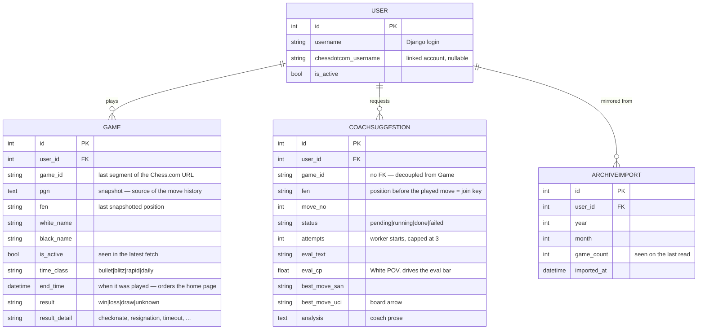
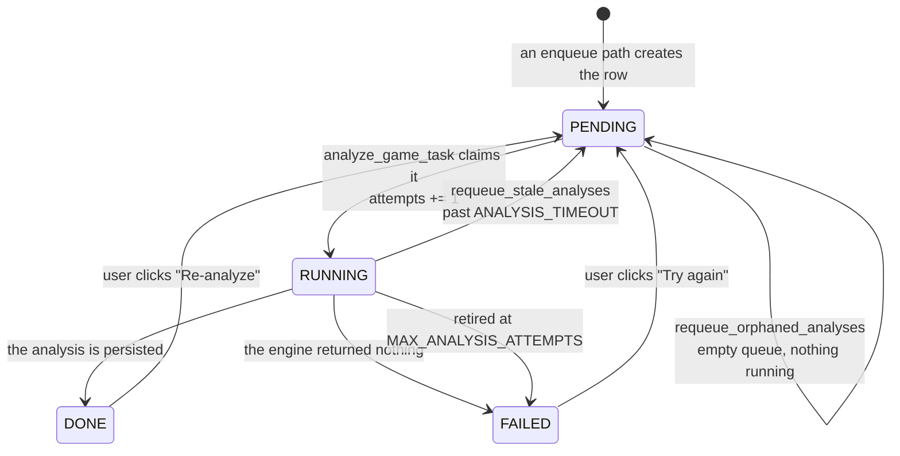

# Data model

Four models, all in [`models.py`](../chessdotcom_ai_coach/models.py). The shape
follows from where games come from: the **monthly archives**, which hold every
finished game (live and daily) but are served a month at a time, dozens of months
per account. `Game` mirrors them locally, `ArchiveImport` remembers how far the
mirroring has got, and `CoachSuggestion` holds what the coach made of a position
once someone asked.



`Game` and `CoachSuggestion` are linked by `(user, game_id)` but there is **no
foreign key** between them — a suggestion survives independently of the game row.

## `User`

Django's `AbstractUser` plus one field:

- **`chessdotcom_username`** — the linked Chess.com account. Nullable and blank.
- **`chess_username`** (property) — the username to actually query, falling back
  to the Django login name when the field is blank. Always use this property;
  the scheduler, views and analysis code all do.

Only users with `is_active=True` **and** a non-empty `chessdotcom_username` are
polled (`scheduler.linked_users`). A user who never set the field is invisible
to the scheduler — this is the most common reason for "nothing shows up on the
home page".

## `Game`

A local mirror of the archive, not a live view. Fields worth calling out:

| Field | Meaning |
| --- | --- |
| `game_id` | The last segment of the Chess.com URL (e.g. `944768131` from `https://www.chess.com/game/daily/944768131`). Not globally unique across users in this table — see the constraint below. |
| `pgn` | The move history. Everything the review page shows is derived from this. |
| `time_class` | `bullet` / `blitz` / `rapid` / `daily` — Chess.com's own value, and what the home filter offers. |
| `end_time` | When the game was played, from the archive. Indexed, and the home page's sort key: an archive arrives in bulk, so `updated_at` records when we *fetched* a game, never when it was played. Null for a game only ever seen as "current". |
| `fen` | The last position snapshotted before the game left "current games". Used for the home card's mini-board; the analysis works off `pgn` instead. |
| `is_active` | `True` = seen in the most recent `current games` fetch. `upsert_current_games` flips to `False` every row it *didn't* just see. **That flip is the app's "the game is over" event**: it is what makes a game visible at all and what makes it eligible for analysis. |
| `result` / `result_detail` | The outcome relative to **this row's user**, plus how it ended. |

**Constraints:** unique on `(user, game_id)`; default ordering
`["-end_time", "-updated_at"]` — newest game first, with `updated_at` breaking
the tie so rows without an `end_time` keep a stable order rather than drifting
between queries.

`game_id` is the last segment of the game URL, which is why a live game and a
daily game are keyed the same way. The archive also carries a globally unique
`uuid`; the URL segment is kept because existing rows and `manage.py
analyze_game` both use it, and a collision between the two id spaces for one user
has not been observed.
The same Chess.com game can therefore be stored twice if both players use the
app — one row each, with opposite `result` values. This is why the `analyze_game`
management command takes an optional `--user`.

### Why a row can have `result` `unknown`

A game written by `upsert_finished_games` always carries its outcome: the archive
states it per side, and `chess_client._outcome` maps that to win/loss/draw plus
the reason (which always lives on the *losing* side — the winner simply reads
"win").

`unknown` therefore means the row did **not** come from the archive. That is the
case for a daily game still in progress, snapshotted by `upsert_current_games`
from a PGN whose `Result` tag is `*`. It resolves itself the next time the
archive is read, because a finished game appears there and the upsert overwrites
the row in place.

A row can stay `unknown` indefinitely in one case: a game played under an alias
the archive does not attribute to this user (`finished_games` skips those). It
remains browsable and analysable — everything else is derived from the stored
PGN — it just never gets a result badge.

Two helpers make templates readable: `has_result` (is it resolved?) and
`result_label` (`"Win"` / `"Loss"` / `"Draw"`, or `""` while unknown).

## `ArchiveImport`

One row per month of a user's archive already read: `(user, year, month)` unique,
plus the `game_count` seen on the last read.

It exists because the import is **paced**. Chess.com serves one month per request
and does not welcome bursts, so `import_archive_month` takes the current month
plus one backlog month per run; without a record of what has been read, every run
would start again from the oldest month and the history would never advance.

The **current month is never treated as done**. It keeps growing as the user
plays, so it is re-read every run and its row refreshed — that is the mechanism
by which a game you finished minutes ago turns up, with no separate watcher.
`game_count` is kept mostly so "no games that month" can be told apart from
"never looked".

## `CoachSuggestion`

One row per analysed position: **at most one per `(user, game_id, fen)`**.

The FEN identifies the position the player faced *before* the move being
reviewed — `fen_before` of a ply in the PGN. Re-analysing the same position
overwrites the row, so each move keeps a single latest analysis instead of
accumulating duplicates.

Rows are created only for moves the user actually played, and only when someone
asks — no schedule creates any. Earlier versions of the app also analysed the
position you were about to play, and **those rows are still in the database**.
They are harmless: nothing renders them, because the templates join suggestions
onto the plies in the PGN and an unplayed position has no ply. Once you did play
that move, the row simply becomes its analysis — the FEN is the same.

### The row is the lock

This is the central design decision in the project. There is no separate lock
table, no Redis lock, no `in_flight` flag:

```python
_row, created = CoachSuggestion.objects.get_or_create(
    user=user, game_id=game_id, fen=move["fen_before"],
    defaults={"status": CoachSuggestion.Status.PENDING, ...},
)
if created:
    analyze_game_task.delay(...)
```

Because the unique constraint on `(user, game_id, fen)` makes `get_or_create`
atomic, `created=True` happens exactly once per position. Both enqueue paths run
this — the **Analyse this game** button and `manage.py analyze_game` — and
enqueue **only** when they created the row. A position already queued, running or
done is skipped for free, which is what makes a second press of the button cost
nothing and removes any need to guard against a double click.

The one place that deliberately bypasses it is the explicit **re-analyze** button
([`views.py::analyze_position`](../chessdotcom_ai_coach/views.py)): on `POST`, the
row is reset to `PENDING` with its fields and `attempts` cleared and re-enqueued
whatever state it was in, in-flight included. That's a user asking for a fresh
take, not a duplicate — and it's the manual way out of the deadlock described
next.

### The lock needs an expiry

Making the row the lock has one failure mode: if the analysis never completes,
nothing ever writes the row to `DONE`. It stays in flight, every later
`get_or_create` finds it and enqueues nothing, and the coach card self-polls for
ever. The lock is held by a task that no longer exists.

Two mechanisms cover it, and they split along a line worth understanding: **is
there a worker on this row or not?**

- **`PENDING` — no worker yet.** The message is on the broker, waiting its turn.
  It can wait a long time and be perfectly healthy: one press of **Analyse this
  game** queues ~40 analyses at 2s of Stockfish plus up to 150s of LLM each, so
  the last one may not start for the better part of an hour. Recovery here is Celery's:
  `CELERY_TASK_ACKS_LATE` means the task is acknowledged after it ran, so a worker
  that dies holding it hands the message back (on a graceful stop) or leaves it
  for the broker's visibility timeout (on a hard kill).

  What that does *not* cover is the message going missing altogether — Redis
  losing the queue, say. The row still reads `PENDING`, so every reconciliation
  pass finds it and enqueues nothing: the position is locked by work that does
  not exist. `scheduler.requeue_orphaned_analyses()` is the way out, and it
  detects the state by comparison rather than by age, because age cannot tell a
  stranded row from one merely queued behind a long scan. **If the broker's queue
  is empty and no row is `RUNNING`, then no `PENDING` row can have a message** —
  whatever its age. That is exact, so it re-enqueues with no false positives and
  no attempt spent.
- **`RUNNING` — a worker claimed it.** `analyze_game_task` sets this as it starts
  and `updated_at` records when. Now there *is* a bound on how long it may take,
  so `scheduler.requeue_stale_analyses()` sweeps anything older than
  `ANALYSIS_TIMEOUT` (10 minutes — a wide margin over the ~152s worst case) back
  to `PENDING` and onto the queue.

Timing out `PENDING` on the same clock would be a bug, not extra safety: it would
re-queue healthy work that was merely waiting, deepening the very backlog it was
reacting to, and burn the retry budget of analyses that never failed.

`attempts` is counted by the **worker**, not by whoever enqueued the task, for the
same reason: a queue wait is not an attempt. The fourth claim on a position
retires it as `FAILED` instead of running it, which is what stops a task that
kills its worker from being redelivered for ever. A `FAILED` row renders as a card
with a "Try again" button rather than a spinner that never resolves.

### Status lifecycle



A row in flight for a few seconds is normal. One that stays `PENDING` across many
ticks and never reaches `RUNNING` means **no Celery worker is running** — the task
went into Redis and nothing consumed it. That is exactly the "Analyzing…" symptom
described in [development.md](development.md), and the reason the timeout does not
apply to `PENDING`: no amount of re-queuing helps when nothing is listening.

### Duplicate rows for one ply

The unique key is the raw FEN, but the same ply can reach the DB under two
spellings. [`services/analysis.py`](../chessdotcom_ai_coach/services/analysis.py)
stores python-chess's `board.fen()`, while rows written by the app's earlier live
path hold Chess.com's spelling of the same position, and the two can differ in
the halfmove clock or the en-passant field. `_covered_plies` therefore reads the
game's existing rows once and matches on `(move_no, side to move)` — the ply
identity `board_utils.annotate_moves` already joins on — before creating
anything. Without it a second request would re-analyse every move that already
has a row under the other spelling.

### Evaluation fields

- **`eval_cp`** — centipawns / 100, always from **White's perspective**, so the
  eval bar has a single consistent orientation. A forced mate is pegged to
  `±10.0` rather than the raw mate score, so the bar saturates instead of
  overflowing.
- **`eval_text`** — the human-readable version of the same thing
  (`"White is clearly better (+1.24)."`).
- **`best_move_san`** / **`best_move_uci`** — the same move twice: SAN for
  display, UCI because `views._uci_to_squares` slices it into from/to squares for
  the board arrow overlay.
- **`analysis`** — the LLM's prose, or the Stockfish-only fallback text when the
  LLM was unreachable. It's never empty for a `DONE` row. On a `FAILED` row it
  carries the engine error, when there was one — a position retired by the
  scheduler has no prose at all, and the card supplies the wording.

**Constraints:** unique on `(user, game_id, fen)`; default ordering
`["move_no", "-updated_at"]`, which is why the analysis-history timeline comes
out in move order without any explicit sort.

## Migrations

`migrations/0001` … `0007`, in [`chessdotcom_ai_coach/migrations/`](../chessdotcom_ai_coach/migrations/).
Applied automatically by [`entrypoint.sh`](../entrypoint.sh) on container start;
run `uv run python manage.py migrate` by hand for local development.
