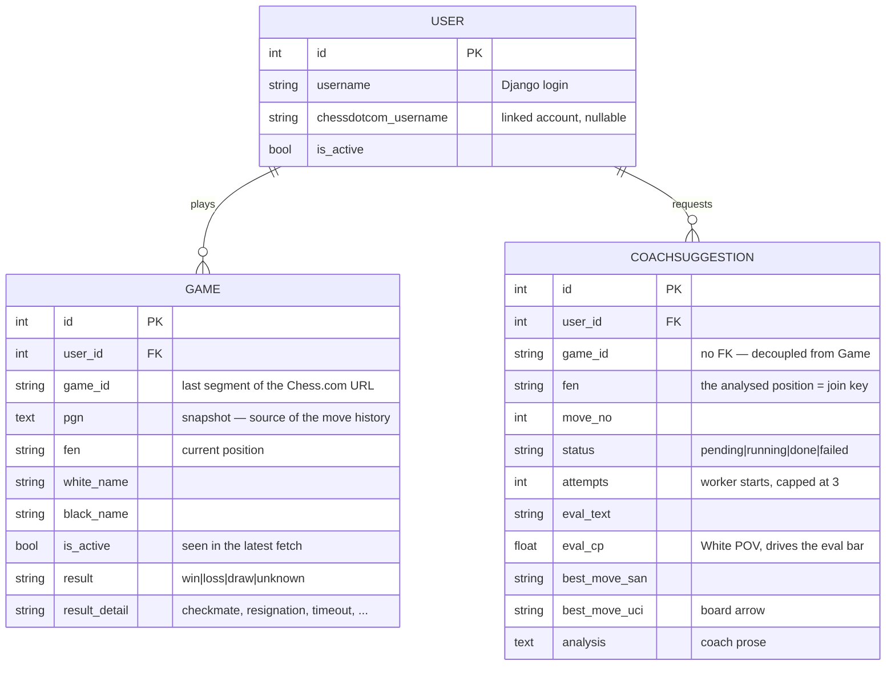
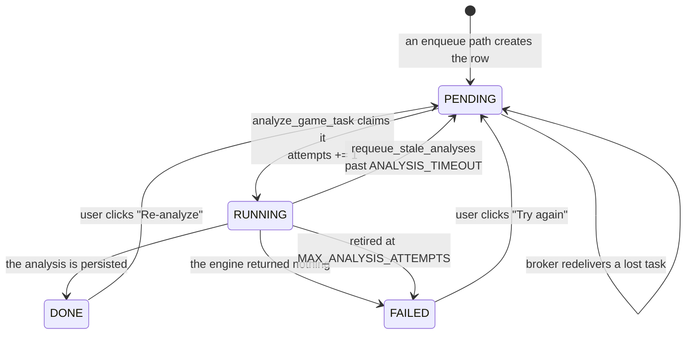

# Data model

Three models, all in [`models.py`](../chessdotcom_ai_coach/models.py). Two of
them exist because of the same constraint: **Chess.com only serves games that are
still in progress.** The moment a game ends it disappears from the `current`
endpoint, so if the app didn't snapshot it, the game — and its whole move list —
would be gone.



`Game` and `CoachSuggestion` are linked by `(user, game_id)` but there is **no
foreign key** between them — a suggestion survives independently of the game row.

## `User`

Django's `AbstractUser` plus one field:

- **`chessdotcom_username`** — the linked Chess.com account. Nullable and blank.
- **`chess_username`** (property) — the username to actually query, falling back
  to the Django login name when the field is blank. Always use this property;
  the scheduler, views and analysis code all do.

Only users with `is_active=True` **and** a non-empty `chessdotcom_username` are
polled (`scheduler._linked_users`). A user who never set the field is invisible
to the scheduler — this is the most common reason for "nothing shows up on the
home page".

## `Game`

A snapshot, not a live view. Fields worth calling out:

| Field | Meaning |
| --- | --- |
| `game_id` | The last segment of the Chess.com URL (e.g. `944768131` from `https://www.chess.com/game/daily/944768131`). Not globally unique across users in this table — see the constraint below. |
| `pgn` | The move history. Everything the review page shows is derived from this. |
| `fen` | The current position, i.e. the one the coach analyses when it's your turn. |
| `is_active` | `True` = seen in the most recent `current games` fetch. `upsert_current_games` flips to `False` every row it *didn't* just see, which is how a game moves to the "past games" history. |
| `result` / `result_detail` | The outcome relative to **this row's user**, plus how it ended. |

**Constraints:** unique on `(user, game_id)`; default ordering `-updated_at`.
The same Chess.com game can therefore be stored twice if both players use the
app — one row each, with opposite `result` values. This is why the `analyze_game`
management command takes an optional `--user`.

### Why `result` starts as `unknown`

A snapshot taken while the game is still current carries a PGN whose `Result` tag
is `*` — the outcome simply isn't in the data. It's resolved afterwards by
`scheduler.backfill_results()`, which reads the **monthly archives** (a different
Chess.com endpoint, where each side carries a `result` code) and calls
`game_store.set_result()`.

The backfill is bounded by `RESULT_BACKFILL_WINDOW` (3 days, in
[`services/scheduler.py`](../chessdotcom_ai_coach/services/scheduler.py)): only
games that ended recently are retried, so a game that can never be resolved — for
instance one played under an alias the archive doesn't match — stops being
re-fetched forever. At a month boundary the previous month's archive is merged in
as a fallback, since long daily games routinely end in a different month from the
one they're queried in.

The backfill also writes the archive's PGN alongside the result: our own snapshot
stops at the last sync before the game left "current games", so it can be missing
the closing moves. Note that this window bounds the **Chess.com calls** only.
Analysis is not enqueued from here — `enqueue_finished_game_analyses` works off
the stored PGN and has no window, so a game whose result never resolves is still
analysed in full.

Two helpers make templates readable: `has_result` (is it resolved?) and
`result_label` (`"Win"` / `"Loss"` / `"Draw"`, or `""` while unknown).

## `CoachSuggestion`

One row per analysed position: **at most one per `(user, game_id, fen)`**.

The FEN identifies the position the player was about to play. Re-analysing the
same position overwrites the row, so each move keeps a single latest analysis
instead of accumulating duplicates.

### The row is the lock

This is the central design decision in the project. There is no separate lock
table, no Redis lock, no `in_flight` flag:

```python
_row, created = CoachSuggestion.objects.get_or_create(
    user=game.user, game_id=game.game_id, fen=game.fen,
    defaults={"status": CoachSuggestion.Status.PENDING, ...},
)
if created:
    analyze_game_task.delay(...)
```

Because the unique constraint on `(user, game_id, fen)` makes `get_or_create`
atomic, `created=True` happens exactly once per position. Every enqueue path runs
this — the 5s tick over active games, the 10 minute scan over finished ones,
`manage.py analyze_game` — and enqueues **only** when it created the row. A
position already queued, running or done is skipped for free, which is precisely
what lets those paths be re-run on a schedule instead of being one-shot triggers.

The one place that deliberately bypasses it is the explicit **re-analyze** button
([`views.py::analyze_position`](../chessdotcom_ai_coach/views.py)): on `POST`, the
row is reset to `PENDING` with its fields and `attempts` cleared and re-enqueued
whatever state it was in, in-flight included. That's a user asking for a fresh
take, not a duplicate — and it's the manual way out of the deadlock described
next.

### The lock needs an expiry

Making the row the lock has one failure mode: if the analysis never completes,
nothing ever writes the row to `DONE`. It stays in flight, every later
`get_or_create` finds it and enqueues nothing, and the coach card self-polls for
ever. The lock is held by a task that no longer exists.

Two mechanisms cover it, and they split along a line worth understanding: **is
there a worker on this row or not?**

- **`PENDING` — no worker yet.** The message is on the broker, waiting its turn.
  It can wait a long time and be perfectly healthy: a scan of a finished game
  queues ~40 analyses at 2s of Stockfish plus up to 150s of LLM each, so the last
  one may not start for the better part of an hour. Recovery here is Celery's:
  `CELERY_TASK_ACKS_LATE` means the task is acknowledged after it ran, so a worker
  that dies holding it causes the broker to **redeliver** it, and it restarts from
  the beginning. Nothing in the app has to notice.
- **`RUNNING` — a worker claimed it.** `analyze_game_task` sets this as it starts
  and `updated_at` records when. Now there *is* a bound on how long it may take,
  so `scheduler.requeue_stale_analyses()` sweeps anything older than
  `ANALYSIS_TIMEOUT` (10 minutes — a wide margin over the ~152s worst case) back
  to `PENDING` and onto the queue.

Timing out `PENDING` on the same clock would be a bug, not extra safety: it would
re-queue healthy work that was merely waiting, deepening the very backlog it was
reacting to, and burn the retry budget of analyses that never failed.

`attempts` is counted by the **worker**, not by whoever enqueued the task, for the
same reason: a queue wait is not an attempt. The fourth claim on a position
retires it as `FAILED` instead of running it, which is what stops a task that
kills its worker from being redelivered for ever. A `FAILED` row renders as a card
with a "Try again" button rather than a spinner that never resolves.

### Status lifecycle



A row in flight for a few seconds is normal. One that stays `PENDING` across many
ticks and never reaches `RUNNING` means **no Celery worker is running** — the task
went into Redis and nothing consumed it. That is exactly the "Analyzing…" symptom
described in [development.md](development.md), and the reason the timeout does not
apply to `PENDING`: no amount of re-queuing helps when nothing is listening.

### Duplicate rows for one ply

The unique key is the raw FEN, but the same ply can reach the DB under two
spellings: the live scheduler stores Chess.com's FEN while
[`services/analysis.py`](../chessdotcom_ai_coach/services/analysis.py) stores
python-chess's `board.fen()`, and the two can differ in the halfmove clock or the
en-passant field. `_covered_plies` therefore reads the game's existing rows once
and matches on `(move_no, side to move)` — the ply identity
`board_utils.annotate_moves` already joins on — before creating anything. Without
it every reconciliation pass would re-analyse every move the coach already handled
live; one query per game rather than per move matters because those passes run on
every active game each tick.

### Evaluation fields

- **`eval_cp`** — centipawns / 100, always from **White's perspective**, so the
  eval bar has a single consistent orientation. A forced mate is pegged to
  `±10.0` rather than the raw mate score, so the bar saturates instead of
  overflowing.
- **`eval_text`** — the human-readable version of the same thing
  (`"White is clearly better (+1.24)."`).
- **`best_move_san`** / **`best_move_uci`** — the same move twice: SAN for
  display, UCI because `views._uci_to_squares` slices it into from/to squares for
  the board arrow overlay.
- **`analysis`** — the LLM's prose, or the Stockfish-only fallback text when the
  LLM was unreachable. It's never empty for a `DONE` row. On a `FAILED` row it
  carries the engine error, when there was one — a position retired by the
  scheduler has no prose at all, and the card supplies the wording.

**Constraints:** unique on `(user, game_id, fen)`; default ordering
`["move_no", "-updated_at"]`, which is why the analysis-history timeline comes
out in move order without any explicit sort.

## Migrations

`migrations/0001` … `0006`, in [`chessdotcom_ai_coach/migrations/`](../chessdotcom_ai_coach/migrations/).
Applied automatically by [`entrypoint.sh`](../entrypoint.sh) on container start;
run `uv run python manage.py migrate` by hand for local development.
